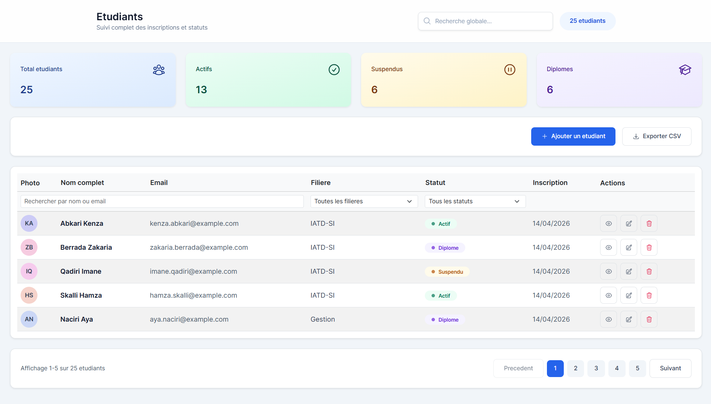

# Gestion des etudiants

## Objet du projet
L'objet principal de ce projet est l'apprentissage de Django, en construisant une application web complete de gestion des etudiants avec une API REST et une interface moderne React.

## Presentation
Cette application permet de gerer des etudiants avec les operations CRUD (creer, lire, modifier, supprimer), l'upload de photo de profil, la recherche, le filtrage, la pagination et l'export CSV.

## Apercu visuel

### Page d'accueil

## Fonctionnalites principales
- Gestion complete des etudiants (CRUD)
- Upload de photo de profil
- Affichage des photos et avatars de secours
- Recherche par nom/email
- Filtres par filiere et statut
- Pagination cote backend
- Export CSV des etudiants
- Interface responsive avec React + Tailwind CSS
- Notifications utilisateur (succès/erreur)

## Stack technique
### Backend
- Django
- Django REST Framework
- django-cors-headers
- Pillow
- SQLite (par defaut)

### Frontend
- React (Vite)
- Tailwind CSS
- React Router
- Axios
- TanStack React Query
- Framer Motion
- React Hot Toast

## Structure du projet
- gestion_etudiants: configuration principale Django
- students: application metier (modele, API, routes, templates)
- frontend: application React
- media: fichiers uploades (photos)
- GUIDE_DEMARRAGE.md: guide de lancement rapide

## API principale
- GET /api/students/
- POST /api/students/
- GET /api/students/{id}/
- PATCH /api/students/{id}/
- DELETE /api/students/{id}/
- GET /api/export/csv/

## Lancement du projet
Consultez le fichier GUIDE_DEMARRAGE.md pour les etapes detaillees sous Windows PowerShell.

Resume rapide:
1. Terminal backend
   - Activer l'environnement virtuel
   - Appliquer les migrations
   - Lancer le serveur Django
2. Terminal frontend
   - Installer les dependances npm
   - Lancer Vite

## Remarques pedagogiques
Ce projet est volontairement structure pour apprendre:
- la modelisation de donnees Django

- la creation d'API avec DRF
- la gestion des fichiers media
- la consommation d'API avec React Query
- la construction d'une UI propre et reutilisable

## Evolutions possibles
- Authentification et gestion des roles
- Gestion des filieres via modele dedie
- Tests automatises (backend + frontend)
- Deploiement cloud (CI/CD)
